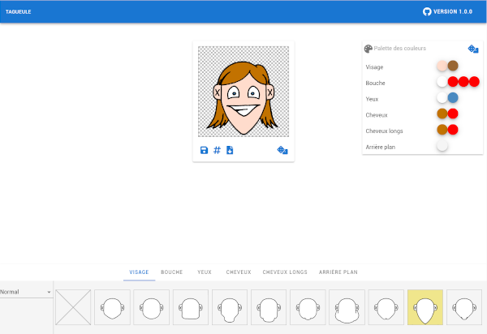

# tagueule

Tagueule est un générateur d'avatar riche et moderne au look cartoonesque. Il a été imaginé pour permettre une grande diversité, et ses librairies s'enrichiront au file du temps.

**[Démo](http://tagueule.com)**

 


## Contribution
Ce projet est libre et open-source. Sous license [GPL 3.0](https://github.com/ikit/tagueule/blob/master/LICENSE).

Toutes participation est la bienvenue. En particulier les artistes en herbes qui souhaiteraient enrichir l'application avec de nouvelles formes ou fonctionnalités.

**Nous recherchons de l'aide pour:**
 * Refaire en svg les tracés (actuellement en png) des formes
 * Ajouter des ombres pour donner plus de relief et de vie au avatars
 * Contribuer à enrichir la bibliothèque en ajoutant de nouvelles formes
 * [Relever les bugs](https://github.com/ikit/tagueule/issues) et pourquoi aider à les corriger vous savez développer


## Documentation
 * [Guide du designer SVG](doc/fr/howto-creating-svg-asset.md)
 * [Guide du dessinateur](doc/fr/howto-drawing-shape.md)
 * [Guide du développeur](doc/fr/devguide.md)


## Installation
**Via le dockerfile**
```
cd ~/git/tagueule/app
docker build -t tagueuleImage .
docker run -it -p 8080:80 --rm --name tagueule-app tagueuleImage
```
L'application est désormais accessible à l'adresse `localhost:8080`


**Via NodeJS directement**
```
cd ~/git/tagueule/app
npm install
npm run dev
```
L'application est désormais accessible à l'adresse `localhost:8080`